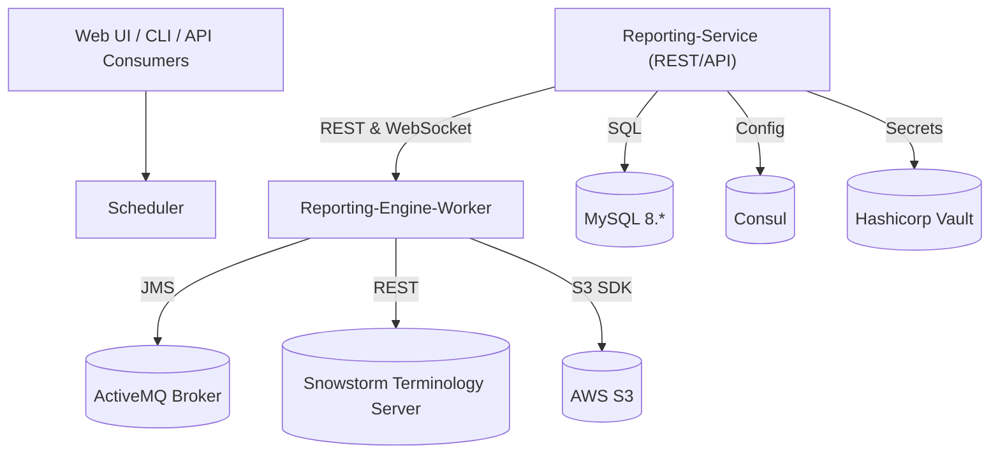
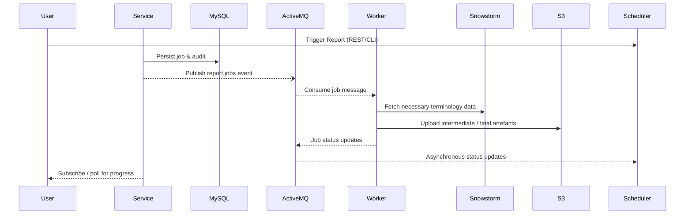

# SNOMED Reporting Engine (SRE)


The **SNOMED Reporting Engine (SRE)** is a collection of Spring Boot–based services that orchestrate the end-to-end life-cycle of **content-quality reports, analytical exports and scripted fixes** against **SNOMED CT** and its extensions.  
It integrates with a rich ecosystem of backend systems—**Snowstorm**, **IMS**, **ActiveMQ**, **AWS S3**, **Consul**, **Vault** and others—while exposing a **REST / WebSocket API** (documented via Swagger-UI) through which UI clients, automation pipelines and power users can trigger, monitor and retrieve reports.

This document explains **how to run SRE locally** and the **engineering best-practices** expected when contributing to the code-base.

---

## 1  High-Level Architecture



<br/>

#### Typical Report-Run Lifecycle



Key points:
* **Stateless** services – job state lives in the DB or external stores, enabling horizontal scalability.
* **Spring Scheduling, JMS & WebSocket** power asynchronous report generation and client notifications.
* **Module-oriented** – the project is split into three independent Spring Boot applications:
  * **`reporting-core`** – library for working with snapshots in memory
  * **`reporting-engine-worker`** – headless worker that executes scripts on demand.
  * **`reporting-service`** – REST API & UI-facing facade that schedules work and persists metadata.
* Each module can be packaged as a fat **JAR** or a Debian **.deb** for production deployment under `supervisord`.

---

## 2  Feature Highlights

* **Interactive Swagger-UI / OpenAPI 3 docs** – automatically exposed by each Spring Boot module.
* **SSO-secured Spring Security layer** – configurable via the `ihtsdo-spring-sso` dependency.
* **Extensive Reporting & Fixing Library** – hundreds of scripts covering quality assurance, terminology analytics, delta comparison, drug validation and more (see `script-engine/src/main/java/org/ihtsdo/termserver/scripting`).
* **JMS Messaging (ActiveMQ)** – queue prefixes (`re.jms.queue.prefix`) enable multi-tenant deployments.
* **AWS S3-backed storage** for release packages, validation resources and generated report artefacts.
* **MySQL persistence** via Spring Data JPA & HikariCP connection pooling.
* **Consul & Vault support** for distributed configuration and secrets management.
* **Cloud-ready logging** with Logback and structured JSON patterns.

---

## 3  Project Layout

```
reporting-engine/
  reporting-core/               ← Core library for building snapshots in memory
  reporting-engine-worker/     ← Worker microservice processing jobs
  reporting-service/            ← REST API for continuously available database view
  docs/                        ← Additional documentation & HOWTOs
  pom.xml                      ← Parent Maven build descriptor
```

Module conventions:
* `scripting`             Domain-specific Groovy/Java scripts (under `reporting-core/.../scripting`).
* `reports`               Pre-packaged report definitions.
* `rest`                  Spring MVC controllers and DTOs (reporting-service).
* `service`               Business logic, services & repositories.
* `util`                  General-purpose helpers.

---

## 4  Getting Started Locally

### 4.1  Prerequisites

1. **JDK 17** (as defined by the parent BOM)
2. **Maven 3.8+** (wrapper provided)
3. **MySQL 8** running on `localhost:3306` with a database called `reporting_service`.
4. **ActiveMQ 5.x** (an embedded broker starts automatically for local dev, but external brokers are recommended for JMS testing).
5. (Optional) **Snowstorm**, **Consul** & **Vault** if you want to mirror a production-like setup.

> Tip: A `docker-compose.yml` for the full stack is planned – contributions welcome!

### 4.2  Clone & Build

```bash
# Clone the repo
git clone https://github.com/IHTSDO/reporting-engine.git
cd reporting-engine

# Build all modules and run the unit tests
./mvnw clean verify
```

* `verify` executes the test-suite and builds `target/<module>-<VERSION>.jar` for every sub-module.
* Run `./mvnw -Pdeb package` to also create Debian packages under each module.

### 4.3  Configuration

1. Copy the default `application.properties` file from each module to an `*-local.properties` variant (already `.gitignored`).  
   Example for *reporting-service*:
   ```properties
   spring.datasource.username=<your-db-user>
   spring.datasource.password=<your-db-pwd>
   reporting.service.terminology.server.uri=http://localhost:8080/snowstorm/snomed-ct/
   re.jms.queue.prefix=local-re
   re.environment.shortname=local
   ```
2. Any property can also be supplied via environment variables, e.g. `SPRING_DATASOURCE_URL` or `AWS_KEY`.

### 4.4  Run

```bash
# Start the Scheduler API
java -Xms512m -Xmx2g \
     -jar reporting-service/target/reporting-service-<VERSION>.jar \
     --server.port=8089 \
     --spring.profiles.active=local

# In a separate shell start a Worker instance (can scale horizontally)
java -Xms512m -Xmx2g \
     -jar reporting-engine-worker/target/reporting-engine-worker-<VERSION>.jar \
     --spring.profiles.active=local
```

Swagger UI for the API will be available at <http://localhost:8089/reporting-service/swagger-ui/index.html>.

---

## 5  Messaging & Async Workflows

* JMS queues are prefixed using `re.jms.queue.prefix` for safe multi-tenant deployments.
* Payload sizes can be tuned via `activemq.max.message.concept-activities`.
* **Consumers must be idempotent** – messages may be redelivered when using ActiveMQ in fail-over mode.

---

## 6  Deployment

### 6.1  Fat JAR

Each module can run standalone:

```bash
java -Xms512m -Xmx4g \
     -Dspring.profiles.active=prod \
     -jar reporting-service-<VERSION>.jar
```

### 6.2  Debian package

1. `./mvnw -Pdeb package`
2. Copy the resulting `.deb` from each module to your server.
3. ```bash
   sudo dpkg -i reporting-service-<VERSION>-all.deb
   sudo systemctl restart supervisor        # if applicable
   ```
   Configuration lives under `/opt/<module>/` and logs under `/var/log/re/`.

---

© SNOMED International – Licensed under the Apache 2.0 License.
